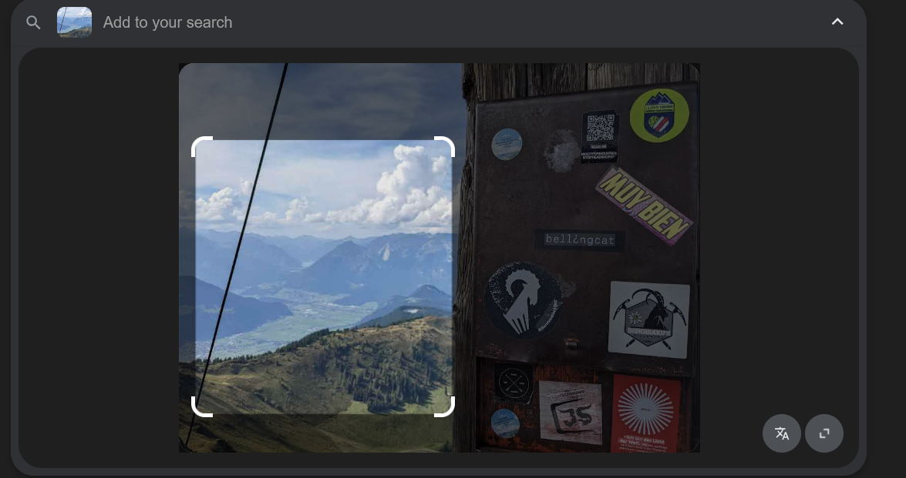

# A Sticky situation

Challenge description

```jsx
In August of 2022, Bellingcat's Foeke Postma found himself looking over
this beautiful view, complete with a Bellingcat sticker!
 
 But where was this enviable mountaineering adventure taking place?
 
 What is the name of the mountain on which Foeke was standing?
```

The image in question is provided in this [link](https://challenge.bellingcat.com/assets/mountain_sticker-_tTHJ90f.jpg). We can start by viewing portions of the image using google lens, to be precise the area where the other hills are visible in order to shorten our scope of search to find the location as shown below.



Looking at the search results we get some of the following details, however we also get a hit on someone’s blog on the challenge.


Following the summary from google AI, we are told it is in Austria, we could start from there and see what we get.


This does not take us near to any thing close to the image. We can try other reverse image search tools such as yandex to see what we get as shown below.


we have found almost a similar image as shown below.


Following the link, it leads to someone’s blog page ,well the challenge is solved to many times. This is a clear indication of how the internet works, the challenge was done by many people and the internet got polluted with images leading to walkthroughs of other people.

Answer: `Wiedersberger Horn`

## sources

- [gudini1](https://teletype.in/@gudini1/bellingcat1)
- [OSINT starter](https://www.osintstarter.com/challenges/bellingcat/bellingcat-globetrotters/a-sticky-situation/)