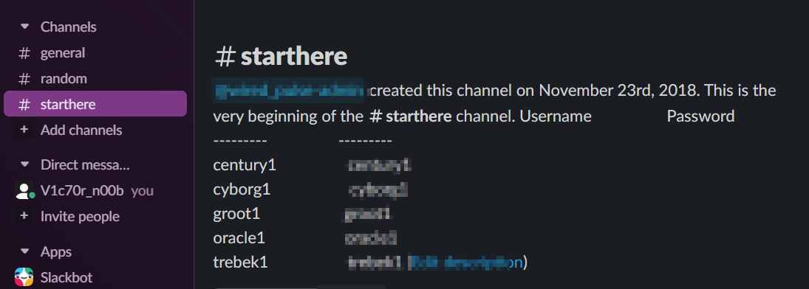

## Century level 0-1

Below is the goal for this challenge, however there is no level 0, we are required to join the Slack channel to get the login details for century level 1 under the start here channel where at the description of the channel, we have the creds for different war games for under the wire.

```powershell
The goal of this level is to log into the game. Do the following in order to achieve this goal.

1. Obtain the initial credentials via the #StartHere channel on our Slack (link). Once you are in the channel, scroll to the top to see the credentials.

2.
 After obtaining the credentials, connect to the server via SSH. You 
will need an SSH client such as Putty. The host that you will be 
connecting to is century.underthewire.tech, on port 22.

3. When prompted, use the credentials for the applicable game found in the #StartHere Slack channel.

4. You have successfully connected to the game server when your path changes to “PS C:\Users\Century1\desktop>”.
```

Below is a screenshot of the details in the description of starthere channel.



After following the instructions, we have been able to login and achieve the objective for this level `The goal of this level is to log into the game.` 

```powershell
#My terminal

Windows PowerShell
Copyright (C) 2016 Microsoft Corporation. All rights reserved.

Under the Wire... PowerShell Training for the People!
PS C:\users\century1\desktop>
```

## Century level 1-2

The objective for this level is as stated below form the website.

```powershell
The password for Century2 is the build version of the instance of PowerShell installed on this system.

NOTE:
– The format is as follows: **.*.*****.****
– Include all periods
– Be sure to look for build version and NOT PowerShell version

IMPORTANT:
Once
 you feel you have completed the Century1 challenge, start a new 
connection to the server, and log in with the username of Century2 and 
this password will be the answer from Century1. If successful, close out
 the Century1 connection and begin to solve the Century2 challenge. This
 concept is repeated over and over until you reach the end of the game.
```

We are required to find the build version of the powershell instance we are in. We can search online to see how one gets to identify powershell build version.


Thanks to Google’s AI, searching has been simplified for us,here is the [link](https://superops.com/powershell-version), as seen above we can use `$PSVersionTable` to know the build version of the PowerShell instance installed on the machine.

```powershell
PS C:\users\century1\desktop> $PSVersionTable

Name                           Value
----                           -----
PSVersion                      5.1.14393.7870
PSEdition                      Desktop
PSCompatibleVersions           {1.0, 2.0, 3.0, 4.0...}
BuildVersion                   [REDACTED]
CLRVersion                     4.0.30319.42000
WSManStackVersion              3.0
PSRemotingProtocolVersion      2.3
SerializationVersion           1.1.0.1
```

As seen above we are able to get the build version of the PowerShell that we can use as our password for the next level, level 2.

## Century level 2-3

Below is the objective for this level.

```powershell
The password for Century3 is the name of the built-in cmdlet that performs the wget like function within PowerShell PLUS the name of the file on the desktop.

NOTE:
– If the name of the cmdlet is “get-web” and the file on the desktop is named “1234”, the password would be “get-web1234”.
– The password will be lowercase no matter how it appears on the screen.
```

We are required to know the cmdlet that is equivalent to the wget command that is commonly used in Linux to download files directly from the internet to your machine or your active directory.

Searching online we get the following as the equivalent of the `wget` command `Invoke-WebRequest` 


The password for the next level is a combination of the command and file in the current directory we are in. Just like Linux to list contents in PowerShell we can use the `ls` command.

```powershell
Windows PowerShell
Copyright (C) 2016 Microsoft Corporation. All rights reserved.

Under the Wire... PowerShell Training for the People!
PS C:\users\century2\desktop> ls

    Directory: C:\users\century2\desktop

Mode                LastWriteTime         Length Name
----                -------------         ------ ----
-a----        8/30/2018   3:29 AM            693 443

```

As seen above, we have a file named `443`, like the HTTPS protocol. Therefore the password syntax will be `command file` just as the example in the challenge description, but without space between.

## Century level 3-4

Below is the objective of the challenge

```powershell
The password for Century4 is the number of files on the desktop.
```

We have to find a way to know the number of files in the desktop in order to get the password for level 4.

Searching online `how to know the number of files in a directory using PowerShell` we get the following.


We can try using the syntax provided to us to see if it will work.

```powershell
PS C:\users\century3\desktop> (get-childitem C:\Users\century3\Desktop
-File | Measure-object).count
[REDACTED]
PS C:\users\century3\desktop>
```

The command works, below is the breakdown of how we used the command to our scenario.

`get-childitem C:\Users\century3\Desktop` 

This command retrieves all items in the desktop directory for user century3.

`-File` 

This parameter filters the results to include only files, excluding directories if there are more directories within the directory we are in.

`| Measure-Object` 

This pipes the output to the `Measure-Object`  cmdlet, which calculates various statistics, including the count.

`.Count` 

This accesses the `count` property of `Measure-Object` output, giving us the total number of files.

## Century level 4-5

Below is the objective for this level.

```powershell
The password for Century5 is the name of the file within a directory on the desktop that has spaces in its name.

NOTE:
– The password will be lowercase no matter how it appears on the screen.
```

We are required to find a way to access directories that have spaces within them in PowerShell.

This one is easy as we can use the `cd` command and enclose the directory with spaces in double quotes to be able to access it.

```powershell
PS C:\users\century4\desktop> cd ".\Can You Open Me"
PS C:\users\century4\desktop\Can You Open Me> ls

    Directory: C:\users\century4\desktop\Can You Open Me

Mode                LastWriteTime         Length Name
----                -------------         ------ ----
-a----        4/27/2025   7:57 PM             24 [REDACTED]

PS C:\users\century4\desktop\Can You Open Me>
```

As seen above, in windows directories are accessed by using the backslash `\` but in linux they are referenced using forward slash `/` but in windows we can also access the  directory without including the `.\` as this suggest change directory to the new directory within this same directory, in this case it is a subdirectory.

```powershell
PS C:\users\century4\desktop> cd "Can You Open Me"
PS C:\users\century4\desktop\Can You Open Me> ls

    Directory: C:\users\century4\desktop\Can You Open Me

Mode                LastWriteTime         Length Name
----                -------------         ------ ----
-a----        4/27/2025   7:57 PM             24 [REDACTED]

PS C:\users\century4\desktop\Can You Open Me>
```

## Century level 5-6

As described in the challenge description, as seen below.

```powershell
The password for Century6 is the short name of the domain in which this system resides in PLUS the name of the file on the desktop.

NOTE:
– If the short name of the domain is “blob” and the file on the desktop is named “1234”, the password would be “blob1234”.
– The password will be lowercase no matter how it appears on the screen.
```

We are required to find the domain name in which the system resides in. In linux, domain names are usually stored in the `etc/host` file where they are mapped to the IP address on which the domain name is linked to via dns in order for us to access it on our machine.

In our case, we need to find a way of reading the host file on windows which is usually stored in

`C:\Windows\System32\drivers\etc.` As seen below, is the output of the content in the host file

```powershell
PS C:\Windows\System32\drivers\etc> type .\hosts
# Copyright (c) 1993-2009 Microsoft Corp.
#
# This is a sample HOSTS file used by Microsoft TCP/IP for Windows.
#
# This file contains the mappings of IP addresses to host names. Each
# entry should be kept on an individual line. The IP address should
# be placed in the first column followed by the corresponding host name
.
# The IP address and the host name should be separated by at least one
# space.
#
# Additionally, comments (such as these) may be inserted on individual
# lines or following the machine name denoted by a '#' symbol.
#
# For example:
#
#      102.54.94.97     rhino.acme.com          # source server
#       38.25.63.10     x.acme.com              # x client host

# localhost name resolution is handled within DNS itself.
#       127.0.0.1       localhost
#       ::1             localhost
        192.99.167.156  games.underthewire.tech
```

From the output above the domain is `underthewire` as it the only uncommented line which means it can be accessed. No we need to go back to the desktop directory of the user century5 and find the file in the directory for us to get our password for century6 as from the description the password is `domain file` without space between.

```powershell
PS C:\Users\century5\Desktop> ls

    Directory: C:\Users\century5\Desktop

Mode                LastWriteTime         Length Name
----                -------------         ------ ----
-a----        8/30/2018   3:29 AM             54 [REDACTED]

PS C:\Users\century5\Desktop>
```

## Century level 6-7

For this challenge, we are required to know the number of folders on the desktop to get the password for level 7.

```powershell
The password for Century7 is the number of folders on the desktop
```

This challenge is similar to the challenge on level 3, but we will use the parameter for directory(similar to folder)for this case.

```powershell
PS C:\users\century6\desktop> (get-childitem C:\users\century6\desktop
-Directory | measure-object).count
[REDACTED]
PS C:\users\century6\desktop>
```

## Century level 7-8

For this challenge we are required to search for a file named readme to get the password for level 8.

```powershell
The password for Century8 is in a readme file somewhere within the 
contacts, desktop, documents, downloads, favorites, music, or videos 
folder in the user’s profile.

NOTE:
– The password will be lowercase no matter how it appears on the screen
```

The trick here is to find a way to search for a file in multiple directories recursively, in Linux the `find` command does the magic, we could search the equivalent of this command as a cmdlet in PowerShell.


As seen above, the cmdlet equivalent of the `find` command is `Get-ChildItem`

```powershell
PS C:\users\century7> get-childitem  -Recurse -File -Filter  readme*

    Directory: C:\users\century7\[REDACTED]

Mode                LastWriteTime         Length Name
----                -------------         ------ ----
-a----        8/30/2018   3:29 AM              7 Readme.txt

PS C:\users\century7>
```

Below is a breakdown of the command.

`get-childitem`

This command retrieves all content in the current directory. Without specification of the directory in which the command is specified to retrieve content from, the command assumes the current directory.

`-Recurse`

This parameter specifies to retrieve content recursively.

`-File` 

This parameter specifies to search for files only 

`-Filter` 

This parameter specifies the files to be retrieved should begin with the word `readme` then followed by anything after it `readme*`

With that, we can go to the directory where our file is located and read the contents of the files using the  `type` cmdlet as shown below.

```powershell

PS C:\users\century7\[REDACTED]> type ".\Readme.txt"
[REDACTED]
PS C:\users\century7\[REDACTED]>
```

## Century level 8-9

We are required to count the number of unique entries in the file currently in the desktop directory of the user century8.

```powershell
The password for Century9 is the number of unique entries within the file on the desktop.
```

For this case we can use the `type` cmdlet then pipe the output to `Measure-object` and then access the `count` property of `Measure-Object` to get the number of unique entries as shown below.

```powershell
PS C:\users\century8\desktop> (type ".\unique.txt" | measure-object).count
[REDACTED]
PS C:\users\century8\desktop>
```

## Century level 9-10

For this challenge, we are required to find the 161st word in the file on the desktop which is the password for level 10.

```powershell
The password for Century10 is the 161st word within the file on the desktop.

NOTE:
– The password will be lowercase no matter how it appears on the screen.
```

Below is the command I used

```powershell
((Get-Content Word_File.txt -Raw) -split '\s+')[160]
```

Here is the breakdown

`Get-Content Word_File.txt -Raw` Reads the whole file as one string.

`-split '\s+'` splits by white space, that is spaces, tabs, newlines

`[160]` gets the 161st word as arrays start from 0, hence the 161st word will be on array `160` 

## Century level 10-11

Below is the description and objective of the challenge.

```powershell
The password for Century11 is the 10th and 8th word of the Windows Update service description combined PLUS the name of the file on the desktop.

NOTE:
– The password will be lowercase no matter how it appears on the screen.
–
 If the 10th and 8th word of the service description is “apple” and 
“juice” and the name of the file on the desktop is “88”, the password 
would be “applejuice88”.
```

We are required to find the `10th` and `8th` word on the Windows update service description and then combine it with the name of the file in the desktop to find the password for level 11.

First we shall output the information about the Windows update service in a well-formatted table using the command below.

```powershell
Get-Service wuauserv | Select-Object -Property * | ft -AutoSize
```

`Get-Service wuauserv` 

- Retrieves the **Windows Update service** (its service name is `wuauserv`).
- This gives you basic info: `Status`, `Name`, and `DisplayName`.

`| Select-Object -Property *` 

- Passes the service object to `Select-Object`.
- `Property *` selects **all properties** of the object, not just the default.

`| ft -AutoSize` 

- `ft` is short for `Format-Table`.
- `AutoSize` adjusts the column widths to fit the content nicely.

After that, we then get the actual description using the command below.

```powershell
 $(Get-WmiObject win32_Service -Filter "DisplayName = 'Windows Update'" | Select-Object -Property Description).Description
```

`Get-WmiObject Win32_Service -Filter "DisplayName = 'Windows Update'”` 

- Retrieves the **Windows Update service** using WMI, filtering by its **display name**.

`| Select-Object -Property Description`

- Selects just the `Description` property from the result.

`.Description`
- Extracts the actual description text from the selected object.

Below is the output from the command.

```powershell
PS C:\users\century10\desktop> $(Get-WmiObject win32_Service -Filter "DisplayName = 'Windows Update'" | Select-Object -Property Description).Description
Enables the detection, download, and installation of updates for Window
s and other programs. If this service is disabled, users of this comput
er will not be able to use Windows Update or its automatic updating fea
ture, and programs will not be able to use the Windows Update Agent (WU
A) API.
```

We will store the output of the above command in a variable, me I called it `$text`
as shown below.

```powershell
 $text = $(Get-WmiObject win32_Service -Filter "DisplayName = 'Windows Update'" | Select-Object -Property Description).Description

```

We shall then use a PowerShell command to concatenate the `10th` and `8th` word plus the file name in the current directory using the command below.

```powershell
$($($text.split(" "))[9] + $($text.split(" "))[7] + $((ls).name)).ToLower()
```

- **`$text.split(" ")`**
    - Splits the string stored in `$text` (assumed to be the service description) into an array of words using **space** as the delimiter.
- **`$($text.split(" "))[9]`**
    - Retrieves the **10th word** (index 9, since PowerShell is 0-based).
- **`$($text.split(" "))[7]`**
    - Retrieves the **8th word** (index 7).
- **`(ls).name`**
    - Gets the **name** of items in the current directory using `ls` (alias for `Get-ChildItem`).
    - If there's **only one file** (e.g., `110`), this will return that file's name (without extension if it's a folder, or with extension if it's a file).
- **`$((ls).name)`**
    - Wraps the above so it works in string concatenation.

Below is the output of the above command.

```powershell
$($($text.split(" "))[9] + $($text.split(" "))[7] + $((ls).name))
[REDACTED]
PS C:\users\century10\desktop>
```

       

## Century level 11-12

Below is the description for the challenge, however, it similar to the challenge in level 7 but this time we are required to search for a hidden file.

```powershell
The password for Century12 is the name of the hidden file within the 
contacts, desktop, documents, downloads, favorites, music, or videos 
folder in the user’s profile.

NOTE:
– Exclude “desktop.ini”.
– The password will be lowercase no matter how it appears on the screen.
```

For this challenge, we shall use the ls command as shown below.

```powershell
ls ..\ -Recurse -Hidden -File | Where-Object { $_.Name -ne 'desktop.ini' }
```

- `ls ..\ -Recurse -Hidden -File`: Lists all hidden files recursively in the parent directory.
- `Where-Object { $_.Name -ne 'desktop.ini' }`: Filters out any file where the name is exactly `desktop.ini`.

Below is the output of the command

```powershell
PS C:\users\century11\desktop> ls ..\ -Recurse -Hidden -File | Where-Ob
ject { $_.Name -ne 'desktop.ini' }

    Directory: C:\users\century11

Mode                LastWriteTime         Length Name
----                -------------         ------ ----
-a-h--        1/23/2025   4:28 PM         262144 NTUSER.DAT
-a-hs-        8/30/2018   3:11 AM          98304 ntuser.dat.LOG1
-a-hs-        8/30/2018   3:11 AM         126976 ntuser.dat.LOG2
-a-hs-        7/12/2020  10:55 PM          65536 NTUSER.DAT{0f893ee4-7
                                                 8e5-11e6-90dd-eefb078
                                                 25ed9}.TM.blf
-a-hs-        6/14/2020   4:36 AM         524288 NTUSER.DAT{0f893ee4-7
                                                 8e5-11e6-90dd-eefb078
                                                 25ed9}.TMContainer000
                                                 00000000000000001.reg
                                                 trans-ms
-a-hs-        7/12/2020  10:55 PM         524288 NTUSER.DAT{0f893ee4-7
                                                 8e5-11e6-90dd-eefb078
                                                 25ed9}.TMContainer000
                                                 00000000000000002.reg
                                                 trans-ms
---hs-        8/30/2018   3:11 AM             20 ntuser.ini
ls : Access to the path 'C:\users\century11\AppData\Local\Application
Data' is denied.
At line:1 char:1
+ ls ..\ -Recurse -Hidden -File | Where-Object { $_.Name -ne
'desktop.i ...
+ ~~~~~~~~~~~~~~~~~~~~~~~~~~~~~
    + CategoryInfo          : PermissionDenied: (C:\users\centur...pp
   lication Data:String) [Get-ChildItem], UnauthorizedAccessExceptio
  n
    + FullyQualifiedErrorId : DirUnauthorizedAccessError,Microsoft.Po
   werShell.Commands.GetChildItemCommand

ls : Access to the path 'C:\users\century11\AppData\Local\History' is
denied.
At line:1 char:1
+ ls ..\ -Recurse -Hidden -File | Where-Object { $_.Name -ne
'desktop.i ...
+ ~~~~~~~~~~~~~~~~~~~~~~~~~~~~~
    + CategoryInfo          : PermissionDenied: (C:\users\century11\A
   ppData\Local\History:String) [Get-ChildItem], UnauthorizedAccessE
  xception
    + FullyQualifiedErrorId : DirUnauthorizedAccessError,Microsoft.Po
   werShell.Commands.GetChildItemCommand

    Directory: C:\users\century11\AppData\Local\Microsoft\Windows

Mode                LastWriteTime         Length Name
----                -------------         ------ ----
-a-h--        8/30/2018   3:11 AM           8192 UsrClass.dat
-a-hs-        8/30/2018   3:11 AM           8192 UsrClass.dat.LOG1
-a-hs-        8/30/2018   3:11 AM           8192 UsrClass.dat.LOG2
-a-hs-        8/30/2018   3:11 AM          65536 UsrClass.dat{d82669b3
                                                 -abff-11e8-90ee-e14c2
                                                 6db97e8}.TM.blf
-a-hs-        8/30/2018   3:11 AM         524288 UsrClass.dat{d82669b3
                                                 -abff-11e8-90ee-e14c2
                                                 6db97e8}.TMContainer0
                                                 0000000000000000001.r
                                                 egtrans-ms
-a-hs-        8/30/2018   3:11 AM         524288 UsrClass.dat{d82669b3
                                                 -abff-11e8-90ee-e14c2
                                                 6db97e8}.TMContainer0
                                                 0000000000000000002.r
                                                 egtrans-ms
ls : Access to the path
'C:\users\century11\AppData\Local\Microsoft\Windows\Temporary
Internet Files' is denied.
At line:1 char:1
+ ls ..\ -Recurse -Hidden -File | Where-Object { $_.Name -ne
'desktop.i ...
+ ~~~~~~~~~~~~~~~~~~~~~~~~~~~~~
    + CategoryInfo          : PermissionDenied: (C:\users\centur... I
   nternet Files:String) [Get-ChildItem], UnauthorizedAccessExceptio
  n
    + FullyQualifiedErrorId : DirUnauthorizedAccessError,Microsoft.Po
   werShell.Commands.GetChildItemCommand

ls : Access to the path 'C:\users\century11\AppData\Local\Temporary
Internet Files' is denied.
At line:1 char:1
+ ls ..\ -Recurse -Hidden -File | Where-Object { $_.Name -ne
'desktop.i ...
+ ~~~~~~~~~~~~~~~~~~~~~~~~~~~~~
    + CategoryInfo          : PermissionDenied: (C:\users\centur... I
   nternet Files:String) [Get-ChildItem], UnauthorizedAccessExceptio
  n
    + FullyQualifiedErrorId : DirUnauthorizedAccessError,Microsoft.Po
   werShell.Commands.GetChildItemCommand

ls : Access to the path
'C:\users\century11\AppData\Roaming\Microsoft\Windows\Start Menu' is
denied.
At line:1 char:1
+ ls ..\ -Recurse -Hidden -File | Where-Object { $_.Name -ne
'desktop.i ...
+ ~~~~~~~~~~~~~~~~~~~~~~~~~~~~~
    + CategoryInfo          : PermissionDenied: (C:\users\centur...do
   ws\Start Menu:String) [Get-ChildItem], UnauthorizedAccessExceptio
  n
    + FullyQualifiedErrorId : DirUnauthorizedAccessError,Microsoft.Po
   werShell.Commands.GetChildItemCommand

ls : Access to the path 'C:\users\century11\Application Data' is
denied.
At line:1 char:1
+ ls ..\ -Recurse -Hidden -File | Where-Object { $_.Name -ne
'desktop.i ...
+ ~~~~~~~~~~~~~~~~~~~~~~~~~~~~~
    + CategoryInfo          : PermissionDenied: (C:\users\century11\A
   pplication Data:String) [Get-ChildItem], UnauthorizedAccessExcept
  ion
    + FullyQualifiedErrorId : DirUnauthorizedAccessError,Microsoft.Po
   werShell.Commands.GetChildItemCommand

ls : Access to the path 'C:\users\century11\Cookies' is denied.
At line:1 char:1
+ ls ..\ -Recurse -Hidden -File | Where-Object { $_.Name -ne
'desktop.i ...
+ ~~~~~~~~~~~~~~~~~~~~~~~~~~~~~
    + CategoryInfo          : PermissionDenied: (C:\users\century11\C
   ookies:String) [Get-ChildItem], UnauthorizedAccessException
    + FullyQualifiedErrorId : DirUnauthorizedAccessError,Microsoft.Po
   werShell.Commands.GetChildItemCommand

ls : Access to the path 'C:\users\century11\Documents\My Music' is
denied.
At line:1 char:1
+ ls ..\ -Recurse -Hidden -File | Where-Object { $_.Name -ne
'desktop.i ...
+ ~~~~~~~~~~~~~~~~~~~~~~~~~~~~~
    + CategoryInfo          : PermissionDenied: (C:\users\century11\D
   ocuments\My Music:String) [Get-ChildItem], UnauthorizedAccessExce
  ption
    + FullyQualifiedErrorId : DirUnauthorizedAccessError,Microsoft.Po
   werShell.Commands.GetChildItemCommand

ls : Access to the path 'C:\users\century11\Documents\My Pictures' is
denied.
At line:1 char:1
+ ls ..\ -Recurse -Hidden -File | Where-Object { $_.Name -ne
'desktop.i ...
+ ~~~~~~~~~~~~~~~~~~~~~~~~~~~~~
    + CategoryInfo          : PermissionDenied: (C:\users\century11\D
   ocuments\My Pictures:String) [Get-ChildItem], UnauthorizedAccessE
  xception
    + FullyQualifiedErrorId : DirUnauthorizedAccessError,Microsoft.Po
   werShell.Commands.GetChildItemCommand

ls : Access to the path 'C:\users\century11\Documents\My Videos' is
denied.
At line:1 char:1
+ ls ..\ -Recurse -Hidden -File | Where-Object { $_.Name -ne
'desktop.i ...
+ ~~~~~~~~~~~~~~~~~~~~~~~~~~~~~
    + CategoryInfo          : PermissionDenied: (C:\users\century11\D
   ocuments\My Videos:String) [Get-ChildItem], UnauthorizedAccessExc
  eption
    + FullyQualifiedErrorId : DirUnauthorizedAccessError,Microsoft.Po
   werShell.Commands.GetChildItemCommand

    Directory: C:\users\century11\[REDACTED]

Mode                LastWriteTime         Length Name
----                -------------         ------ ----
--rh--        8/30/2018   3:34 AM             30 secret_sauce
ls : Access to the path 'C:\users\century11\Local Settings' is denied.
At line:1 char:1
+ ls ..\ -Recurse -Hidden -File | Where-Object { $_.Name -ne
'desktop.i ...
+ ~~~~~~~~~~~~~~~~~~~~~~~~~~~~~
    + CategoryInfo          : PermissionDenied: (C:\users\century11\L
   ocal Settings:String) [Get-ChildItem], UnauthorizedAccessExceptio
  n
    + FullyQualifiedErrorId : DirUnauthorizedAccessError,Microsoft.Po
   werShell.Commands.GetChildItemCommand

ls : Access to the path 'C:\users\century11\My Documents' is denied.
At line:1 char:1
+ ls ..\ -Recurse -Hidden -File | Where-Object { $_.Name -ne
'desktop.i ...
+ ~~~~~~~~~~~~~~~~~~~~~~~~~~~~~
    + CategoryInfo          : PermissionDenied: (C:\users\century11\M
   y Documents:String) [Get-ChildItem], UnauthorizedAccessException
    + FullyQualifiedErrorId : DirUnauthorizedAccessError,Microsoft.Po
   werShell.Commands.GetChildItemCommand

ls : Access to the path 'C:\users\century11\NetHood' is denied.
At line:1 char:1
+ ls ..\ -Recurse -Hidden -File | Where-Object { $_.Name -ne
'desktop.i ...
+ ~~~~~~~~~~~~~~~~~~~~~~~~~~~~~
    + CategoryInfo          : PermissionDenied: (C:\users\century11\N
   etHood:String) [Get-ChildItem], UnauthorizedAccessException
    + FullyQualifiedErrorId : DirUnauthorizedAccessError,Microsoft.Po
   werShell.Commands.GetChildItemCommand

ls : Access to the path 'C:\users\century11\PrintHood' is denied.
At line:1 char:1
+ ls ..\ -Recurse -Hidden -File | Where-Object { $_.Name -ne
'desktop.i ...
+ ~~~~~~~~~~~~~~~~~~~~~~~~~~~~~
    + CategoryInfo          : PermissionDenied: (C:\users\century11\P
   rintHood:String) [Get-ChildItem], UnauthorizedAccessException
    + FullyQualifiedErrorId : DirUnauthorizedAccessError,Microsoft.Po
   werShell.Commands.GetChildItemCommand

ls : Access to the path 'C:\users\century11\Recent' is denied.
At line:1 char:1
+ ls ..\ -Recurse -Hidden -File | Where-Object { $_.Name -ne
'desktop.i ...
+ ~~~~~~~~~~~~~~~~~~~~~~~~~~~~~
    + CategoryInfo          : PermissionDenied: (C:\users\century11\R
   ecent:String) [Get-ChildItem], UnauthorizedAccessException
```

From the output above, we can easily find the file which `secret_sauce`

## Century level 12-13

Below is the description for the challenge in this level.

```powershell
The password for Century13 is the description of the computer designated as a Domain Controller within this domain PLUS the name of the file on the desktop.

NOTE:
– The password will be lowercase no matter how it appears on the screen.
– If the description “today_is” and the file on the desktop is named “_cool”, the password would be “today_is_cool”.
```

 We are required to find the description of the computer designated as a Domain Controller within this domain.

Below is the  command I used to get the AD details.

```powershell
Get-ADComputer -Filter * -Properties Can
onicalName,description
```

The above command retrieves **all Active Directory computers** along with their `CanonicalName` and `description` properties.
Below is the output of the command.

```powershell
PS C:\users\century12\desktop> Get-ADComputer -Filter * -Properties Can
onicalName,description

CanonicalName     : underthewire.tech/Domain Controllers/UTW
Description       : [REDACTED]
DistinguishedName : CN=UTW,OU=Domain
                    Controllers,DC=underthewire,DC=tech
DNSHostName       : utw.underthewire.tech
Enabled           : True
Name              : UTW
ObjectClass       : computer
ObjectGUID        : 5ca56844-bb73-4234-ac85-eed2d0d01a2e
SamAccountName    : UTW$
SID               : S-1-5-21-758131494-606461608-3556270690-1000
UserPrincipalName :

CanonicalName     : underthewire.tech/Computers/192.99.167.156
Description       :
DistinguishedName : CN=192.99.167.156,CN=Computers,DC=underthewire,DC=
                    tech
DNSHostName       :
Enabled           : True
Name              : 192.99.167.156
ObjectClass       : computer
ObjectGUID        : d8247090-aa0e-456e-b9b0-a6a55f6469c5
SamAccountName    : 192.99.167.156$
SID               : S-1-5-21-758131494-606461608-3556270690-2182
UserPrincipalName :

```

With that, we can then list the contents on the desktop of the user and see the file we require to link the name with the description details to get our password.

## Century level 13-14

For this challenge, we are required to know the number of words within the file on the desktop.

```powershell
The password for Century14 is the number of words within the file on the desktop.
```

We shall use the below command to get the number of words in the file.

```powershell
 (ls | gc).split(" ").count
```

Below is the breakdown of the command.

`ls` lists the contents of the current directory.

`| gc` is a short form for `Get-Content` the out of the command `ls` is piped to this command in order to use its property of `count` to get the number of words in the file.

`split(" ")` this command splits whitespaces within the file.

`.count` the property for the command `Get-Content` that is used to count the number of words in the file.

## Century level 14-15

For this challenge, we are required to count the number of times the word `polo` appears in the file on the desktop.

```powershell
The password for Century15 is the number of times the word “polo” appears within the file on the desktop.

NOTE:
– You should count the instances of the whole word only..
```

We shall use the following command.

```powershell
 $($(gci | gc).split(" ") | ? {$_ -eq "polo"}).count
```

Below is the break-down of the command.

- **`gci`**
    
    This is short for `Get-ChildItem`, which lists files and directories in the current directory.
    
- **`gci | gc`**
    
    This passes the list of files from `gci` to `gc`, which is short for `Get-Content`.
    
    So this reads the content of all files in the current directory.
    
- **`.split(" ")`**
    
    This splits all the contents (as a single string) by spaces into individual words.
    
- **`| ? {$_ -eq "polo"}`**
    
    This filters the resulting words for ones that are exactly equal to `"polo"`.
    
    - `?` is short for `Where-Object`
    - `$_` refers to the current object in the pipeline
- **`$(...)`**
    
    This is a sub-expression. It evaluates the command inside and substitutes its result in place.
    
- **`$(...).count`**
    
    After filtering out `"polo"` from the split words, `.count` gets the total number of times `"polo"` appears.
    

Below is the output of the command.

```powershell
PS C:\users\century14\desktop>  $($(gci | gc).split(" ") | ? {$_ -eq "p
olo"}).count
[REDACTED]
PS C:\users\century14\desktop>
```

## Century level 15

We are done with the challenge on to the next.

```powershell
Congratulations!

You have successfully made it to the end!

Try your luck with other games brought to you by the Under The Wire team.

Thanks for playing!

Windows PowerShell
Copyright (C) 2016 Microsoft Corporation. All rights reserved.
PS C:\users\century15\Desktop>ls
😁😄😃 
```