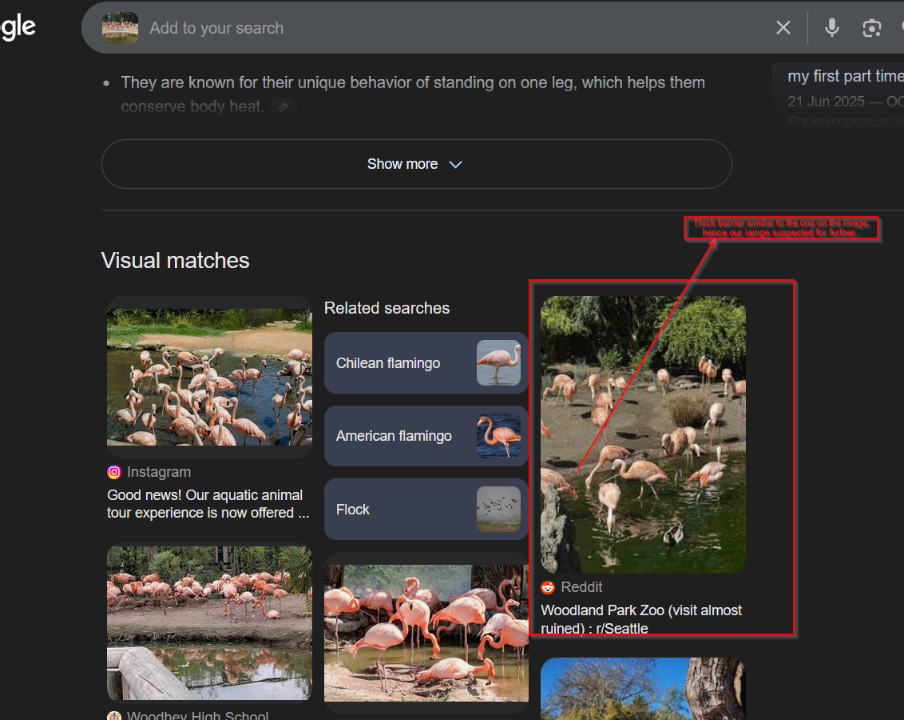

# Flamin-Go Find it

Challenge description

```jsx
When Kolina was out and about she snapped this shot of some friendly flamingos. 

These wading birds are known for their long legs and bright pink plumage, and
can be found all around the world. Can you wade through this challenge 
to find them?

What is the name of the area in which you'd find these flamingos?
```

The image can be found in this [link](https://challenge.bellingcat.com/assets/flamingos-BFhF5u1R.jpg).

Just like the other challenge we can start by doing a reverse image search as shown below.



From the above evidence, we have got a hit on a [reddit post](https://www.reddit.com/r/Seattle/comments/1kuplqd/woodland_park_zoo_visit_almost_ruined/), we can look at it. From the post it is clear the zoo is under pollution. Putting the two images side to side we get a lot of factors that are similar as shown below.


Answer: **`Woodland Park Zoo`**