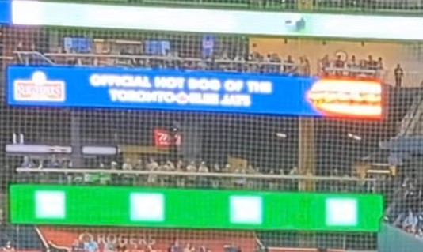

# Foul play

Challenge description

```jsx
This is what it looks like to be on the receiving end of a foul ball at a baseball game.
Be careful out there! But who is responsible for this hit?

What is the name of the batter?
```

The video to the challenge can be found from this [link](https://youtu.be/THeJFjKhb9Y).

For analysis we could download the video to our machine using tool such us ytdlp then retrieve frames of the image for analysis.



Analyzing the images, we see ads showing the hosts of the match as the Toronto Blue jays who usually play their matches at the  rogers centre.


From the above image we have someone named 31 Deloach, we can search online who it is.


He is called `Zach Deloach`. We could try submit this name and see if it is the answer.


This was easy, however, in OSINT it is usually good to verify why your answer is that. For further understanding you could refer to some of the blogs as listed blow.

- [Mathieu Gaucheler](https://medium.com/@shibaosint/bellingcat-challenges-urban-exploration-6aabcceb447a)
- [gudini1](https://teletype.in/@gudini1/bellingcat3)