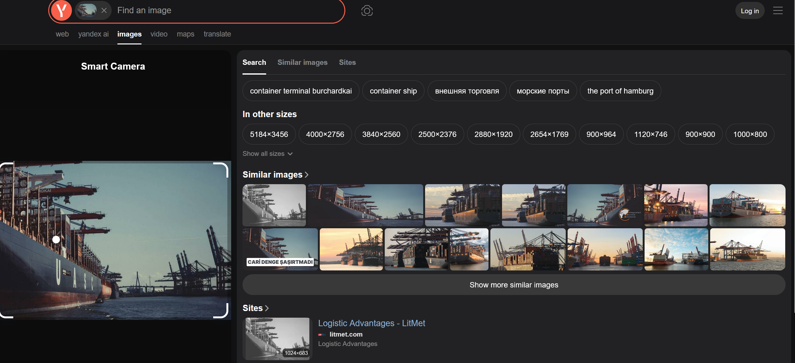

# Fully stocked

Challenge description.

```jsx
Container vessels are a common sight in ports around the world, but this one is particularly well-stocked.

They're a vital part of the global supply chain, but where is this one moored?

In which city would you find this port?
```

The image can be found from the [link](https://challenge.bellingcat.com/assets/moored_ship-B0-TXAUs.jpg)

We shall start by a simple reverse image show using yandex as shown below.



Looking at some of the images, we get a clear part of the name as shown below.


From the looks, it appears this is a port, we could search for ..chardkai port and see where it leads us. Doing a google search led me to a terminal named `Terminal Burchardkai, in Hamburg` . Looking at google maps for the same terminal, I was provided with images similar to the one we have as shown below.


The ship is named UASC.

Answer: `Hamburg`