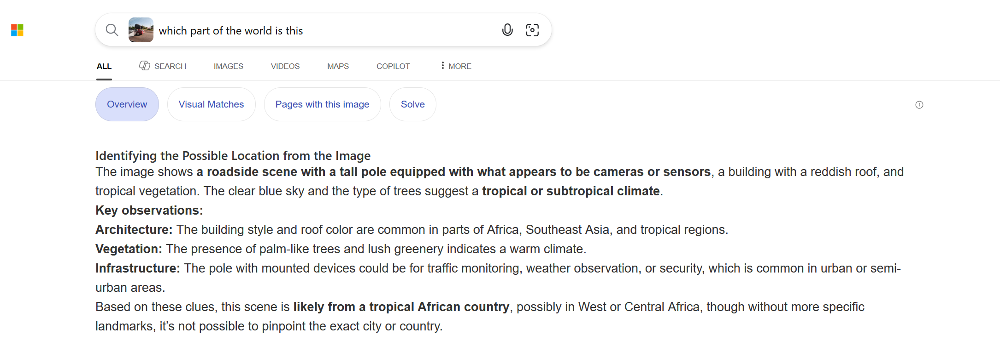

# Highway to the unknown

Challenge descritpion

```jsx
A car’s moving quickly along a highway, luckily there are some visible 
structures in the rear-view mirror and on the road-side to help you with your geolocation.

The prominent building bears the name of a person, 
 
 what is that name?
```

The image to the challenge can be found [here](https://challenge.bellingcat.com/assets/highway-Dxd_ClsZ.jpg).

We can start by first analyzing the image to find items that can help us identify things which can give us a lead.

- The side mirror shows an image of a some sort of a pedestrian bridge.
- The white number plate
- The cars driving on the right

Since AI is advancing, I did a reverse image search on some parts of the image and asked for a likely region where the image could have been taken from and got the following summary as shown below.




Could be from parts of West Africa. From the suggestions I decided to start with Nigeria.

We shall use overpass turbo to help us get the region. To understand how we can reference the roads on the image we can follow insights from this [post](https://wiki.openstreetmap.org/wiki/Highway_Tag_Africa).

```jsx
// Find the geographic area whose English name is Nigeria
// and store it in a variable called .a
area["name:en"="Nigeria"]->.a;

// Select ways and relations (wr) representing roads
// Filter roads whose highway tag is motorway OR primary
// Exclude any road that has the bridge tag
// Limit the search to the previously defined Nigeria area (.a)
wr[highway~"motorway|primary"][!bridge](area.a);

// Select ways that are bridges
// Filter them to only pedestrian paths (footway or path)
// around:0 means find those that intersect or touch
// the results from the previous query
way[bridge][highway~"footway|path"](around:0);

// Output the results including full geometry coordinates
// so they can be drawn on a map
out geom;
```

The output provide 95 points as shown below.


The image of the house was found on the point shown below.


Below is the image of the house on the challenge image.


On the map the house is labelled as Daughters of Abraham Foundation.


But if you look at the photos, you can see that it has the name Julie Useni Hall. .


Answer: `Julie Useni`