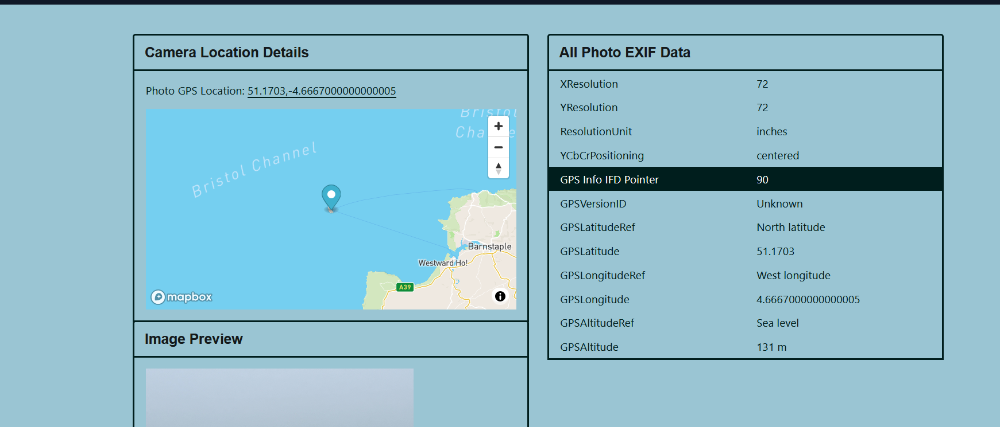

# Lost in the Fog

Challenge description

```jsx
For this photo Nick was stood in a field shrouded in a thick fog. 
At least it looks like there's an airport nearby.But what airport is it? 

It's not complex if you know how to look!

What is the ICAO code for the airport?
```

The image can be found from this [link](https://challenge.bellingcat.com/assets/foggy_field-CVCShq-A.jpg).

Since the image is quite difficult to find  a lot of stuff, we could use extra [tool](https://onlineexifviewer.com/) to view the exif data of the image to find location of the image as shown below.



Following the GPS coordinates, we are led near to `Lundy Island` as shown below.


Looking closely to the image, we can see a figure looking like an airplane as shown below.

Searching online what ICAO is, we get to find that it is `International Civil Aviation Organization.` This has made it easier for us to search online for ICAO code for airport in Lundy island


The search result online.


The result found is from this [link](https://airportguide.com/airport/info/EGZV).

Answer: `EGZV`