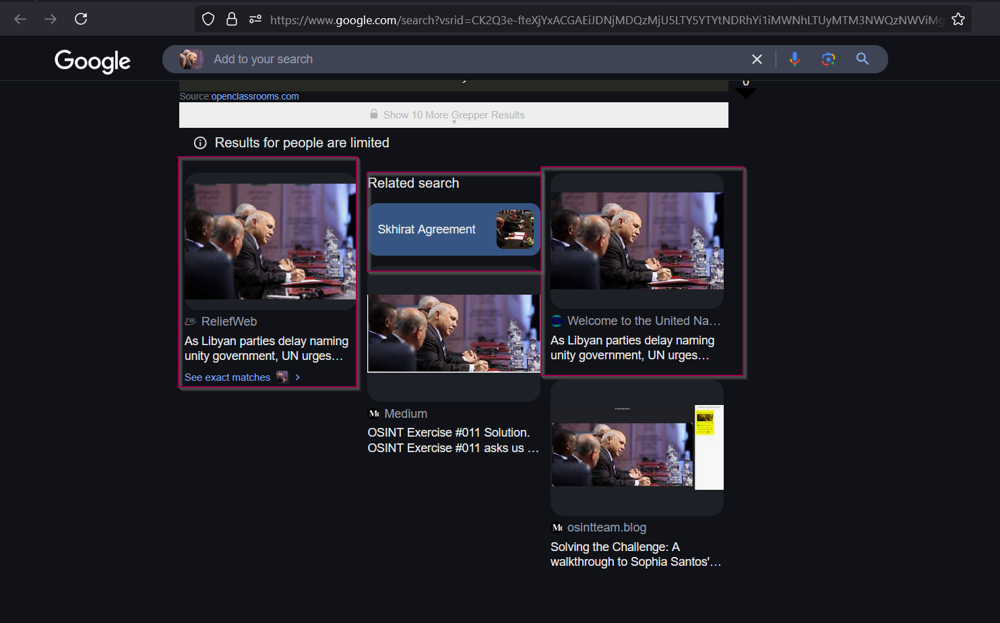
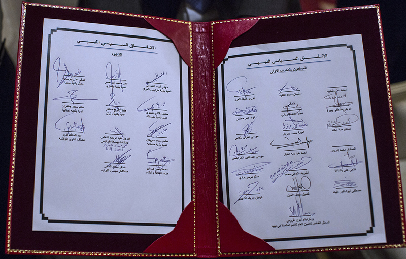

# Exercise 11

This [challenge](https://gralhix.com/list-of-osint-exercises/osint-exercise-011/) was quite hard for me, we are provided with an image that is not completely clear, however, we are required to find the name of the four individuals on the image as stated in the task briefing as shown below.

```bash
The photo below depicts four individuals.
Your task is to identify them all.
```


Above is the image we are required to use to find the name of the individuals on the image.

We shall start by doing a reverse image search to see if we can find any information about the image.



We have found some information `skhirat Agreement` and some links, I decided to follow the one for [United Nations](https://www.un.org/africarenewal/news/libyan-parties-delay-naming-unity-government-un-urges-steps-end-political-divisions).


The photo is by UNSMIL(United Nations Support Mission in Libya). We can head to UNSMIL and look around if we can get more information about the image but from the photo we can identify some information as shown below.


As analyzed form the image above we can start searching for one individual at a time, furthermore as from our searches, this event was conducted by UN. As I have witnessed, more than one event conducted by the UN are usually filled with audience and important guest of the events surely seat at the front row. From UNSMIL, I was able to identify our photo and more with individuals on our photo as shown below.


Analysis from the challenge image


I tried to do a reverse search for the people identified but got no useful information however, searching  for the agreement form they signed got me a bit of information. With this form, I could search for the event further.


here is a clearer image.



Searching the internet, I was able to find one of the members in the challenge photo as shown below.


## Person 1


Following the [link](https://www.timesfreepress.com/news/2015/jul/11/libyan-parties-reach-peace-deal-without-tripoli-go/), we are given clearly the name as shown below.


Searching his name online, we get more details about the person.


Searching further his full name is `Moustafa Abushakor Ghaith` 

## Person 2

I found an image of this member 


What made come to conclusion he was among the members in the photo was after I carefully analyzed the hair pattern of the individual in the challenge photo and this photo.


scrolling through the photos, I found the same person again signing the document we identified earlier as shown below.


If we zoom a little bit closer, we can be able to identify the location of where the person was signing as shown below.


with that we can get the name of the person from this file using google translate.


Using google translate, it was unable to get the whole name as shown below.


however, I searched for the document that was signed and found his name after searching through all the names in this [document](https://unsmil.unmissions.org/sites/default/files/Libyan%20Political%20Agreement%20-%20AR%20-%20w%20Signatures.pdf) . His name is `Salih Hama bakdah` 


## Person 3 and 4

After finding this [document](https://unsmil.unmissions.org/sites/default/files/Libyan%20Political%20Agreement%20-%20AR%20-%20w%20Signatures.pdf) and searching the names, I was able to identify the two remaining people. As shown below.

`person 3 (فضيل محمد الأمين )Fadil Mohamed Alamen`


For me to identify it was this man shown below was the cheeks after looking through some of his photos and comparing it with the one on the challenge photo.


`person 4 (محمد سعد امعزب)Fadil Mohamed Alamen` 


What enabled me to identify person 4 as shown above was the following identifiers as shown below.


This challenge was not easy but I learnt a lot concerning how to study human facial structure for facial recognition,however there are systems nowadays that can do this automatically without manual intervention most of the time thanks to artificial intelligence.