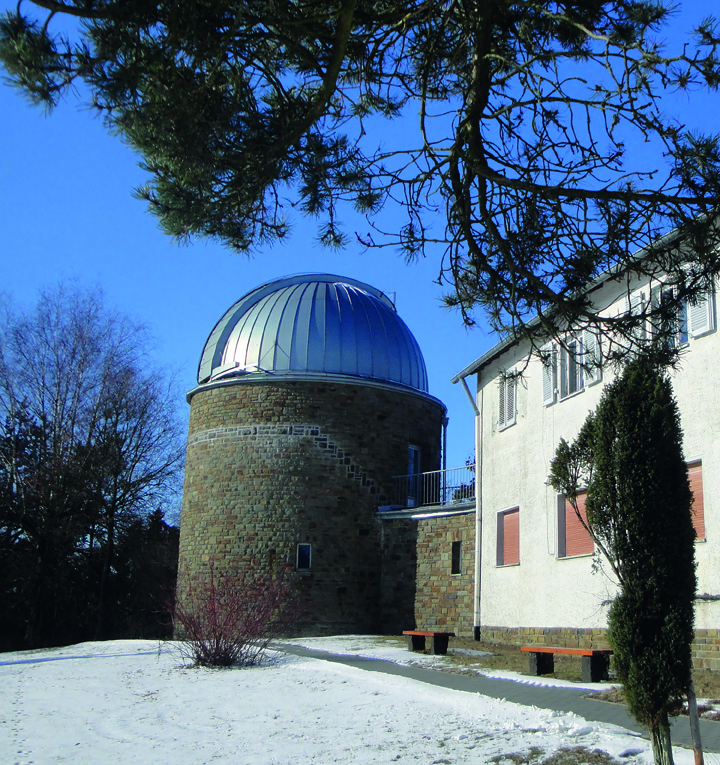

# Exercise 15

For this [challenge](https://gralhix.com/list-of-osint-exercises/osint-exercise-015/) we are given a picture giving a description of a telescope we have to find it and locate where it is placed as described in the task briefing below.

```jsx
The image below is a screenshot taken from a CIA declassified 
document. It depicts a caption report of an undisclosed photo taken by 
an agent. The text mentions a telescope “being assembled at factory“.

Your task is to find:

a) A photo that matches the description on the caption report.
b) The exact location of where the telescope was placed once completed.
```


## A photo that matches the description on the caption report

From the above photo, we can see some clear descriptions of the telescope. The information I used is `telescope for the university of bonn, built at the askania factory, jan 18, 1953` with this information we can search for the telescope on google and see what we shall find as shown below.


Interesting findings, going to the first [link](https://web.astronomicalheritage.net/show-entity?identity=114&idsubentity=1) and searching through the page, I got an interesting image with some information form our challenge document as shown below.


To verify if this is our telescope, I searched for it and see its elements if they match the description on the document.


As seen above from this [source](https://www.imago-images.com/st/0061895213), we can now verify the telescope we fund matches the description on the document.


Therefore the telescope being identified is as shown below.


## The exact location of where the telescope was placed once completed

From this [site](https://web.astronomicalheritage.net/show-entity?identity=114&idsubentity=1),we got a description of the telescope and where it is located at the `Hoher list observatory` as shown below.


Searching on the same page again for `Tower 1` I got an image of the tower as seen below.




We can search on google maps for the Bonn observatory and see if we can be able to locate the tower with the following patterns as described below.


From google maps we have been able to identify a tower with the surrounding descriptions from our analyzed image above as shown below.


To confirm if it is the tower we can see if there is a street view of the place and see if we can identify if it is truly the tower.


With that evidence we can now clearly identify that our tower is as shown below.


`Answer: 50°09'42.6"N 6°50'54.0"E`
