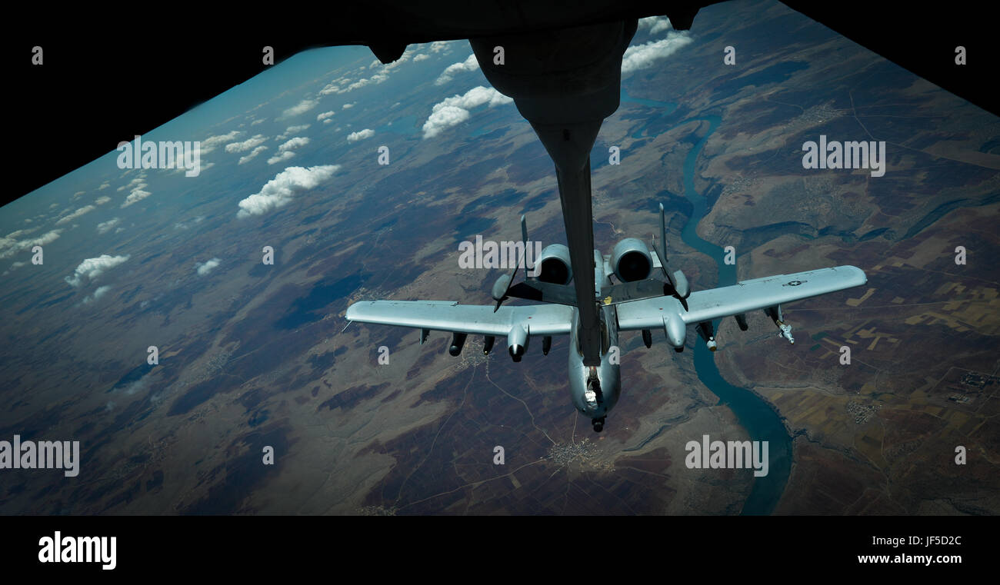

# Exercise 16

This [challenge](https://gralhix.com/list-of-osint-exercises/osint-exercise-016/) was quite mind draining, we are required to find the location where the military aircraft was flying over as described in the task briefing below.

```jsx
On November 25, 2020, a Twitter user shared the photo below. It depicted a military aircraft flying over an “undisclosed location”. 
Your task is to disclose that location.
```


A clearer image for the same is shown below.


## Finding the location

For us to find more details, we shall perform a reverse image search and see if we can find more information about the aircraft.


From [tineye](https://www.tineye.com), we got some interesting information, I shall be looking into the alamy source as it contains more stock images for the same.


Form the image we have gotten some information `Operation inherent resolve, May 31,2017, battle areas, Air force A-10 Thunderbolt II` with this information we can search to find more details about the operation and where it was being conducted on May 31,2017 and it is likely to be in a war tone country and from the picture, it could in a semi-arid regions.


We now know the operation was a joint task force between US, Iraq and Syria. Searching on alamy images for the same operation and filtering for the date `May 31,2017` ,we get more images that can help us identify our location and we are also able to find our challenge image as shown below.


Going through the photos, I was able to identify this photos that have unique geographical structures that can aid in locating our location.





With those images we can now play around with google earth pro to find the locations identified. This route was very tiresome, however, doing more research about the mission, I came across this [document](https://www.inherentresolve.mil/Portals/14/Documents/Strike%20Releases/2017/05May/20170531%20Strike%20Release%20-%20Final.pdf?ver=2017-05-31-070447-593) giving details of locations where strikes were made.


The analysis from one of the photos I found is as shown below.


We have been able to identify one photo and where the aircraft was at the moment.


The second place from the image collections we have been able to locate it.

After a while of roaming through the map, I was able to find the location of where our air-craft was located as shown below.


`Answer:  37°39'21.98"N, 38° 5'41.83"E`