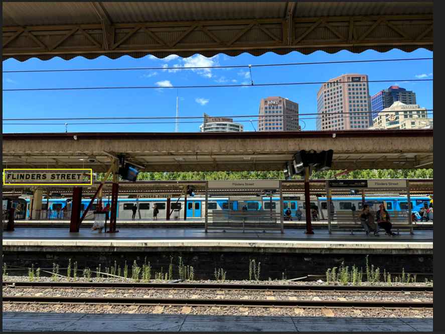

# Exercise 2

In this [challenge](https://gralhix.com/list-of-osint-exercises/osint-exercise-002/) we are required to find the name of the train station and the name and height of the tallest building in the image.

```bash
Task briefing: 
The photo below was shared on social media. It clearly depicts a train station.
Please answer the following questions:

a) What is the name of the train station seen in the photo?
b) What is the name and height of the tallest structure seen in the photo?
```

The image we are given is as shown below.


However, if you want the entire image you can download it from this [link](https://gralhix.com/wp-content/uploads/2024/09/osint-exercise-002-big-picture.png).

## name of the train station seen in the photo

To find the name of the train station we could use reverse image search or simply search on google maps the name that is clearly seen in the image.



We shall start with reverse image search where I will be using [google lens](https://lens.google/) for this instance but there are a variety of tools for doing reverse image search such as

1. [Pimeye](https://pimeyes.com/en)
2. [googl lens](https://lens.google/)
3. [Tineye](https://tineye.com/)
4. [yandex](https://yandex.com/)
5. [reveye](https://www.reveye.in/)(This is an extension that can be downloaded on your browser to aid in doing reverse image searches)

just to mention a few.

Using google lens we found the name of the railway station as shown below.


To confirm if that is the real name of the station we could search the name flinders street on google maps or google earth pro and see if we shall get the station.


Search as of google earth pro.


Search as of google maps.

`Answer: Flinders Street Railway Station`

## name and height of the tallest structure seen in the photo

Now for this section we had to find the street view in order to identify the buildings seen on the image and search for their heights online as it is hard to tell the height of a building from an image.

From google earth pro street view we are able to see four buildings that are available but one building is missing.


Street view analysis from google earth pro.


The building that is missing from the street view image.

However, from the street view image I did some deep google search of the height of the four buildings I identified but two had heights that caught my interest as shown below.


The two buildings **Arts Centre Melbourne of height 162 metres and IBM Australia of height 131 metres, however we could not conclude our search there as there is a building that is lacking form our street view, we could therefore play with the time frames from google earth to see the structure when it was available at the time of the picture being taken.**

After a few minutes of adjusting the time frame to the year 2012, I got a building structure that was not available at our street view as of 2025 as shown below.


As shown below are the structures that were on the image during the capture.


zooming closer, we are able to find the name of the building as shown below.


searching it on google maps as central equity Melbourne as the area is in Melbourne Australia we get this apartment.


Looking at the street view, it is located behind the two buildings we had identified earlier on the image as shown below and it is indeed the structure that was missing on our earlier street view.


Searching the height of the building it is 167 metres or 545 ft high as indicated [here](https://www.skyscrapercenter.com/building/focus-melbourne/38852).

Therefore comparing the heights of the three buildings

1. FOCUS Apartments by Central Equity of height 167 metres
2.  **Arts Centre Melbourne of height 162 metres**
3. **IBM Australia of height 131 metres**

we find that the tallest structure is FOCUS Apartments by Central Equity with a height of 167 metres.

`Answer FOCUS Apartments by Central Equity of height 167 metres`