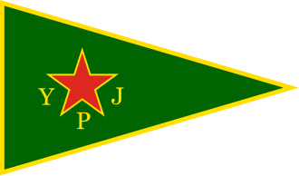
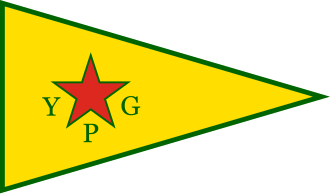

# Exercise 24

For this [challenge](https://gralhix.com/list-of-osint-exercises/osint-exercise-024/), we are required to find where the members in the photos pay their allegiance to as indicated in the task briefing below.

```jsx
There are countless armed insurgent groups spread throughout the globe. The three images below depict individuals associated with internationally recognised terrorist organisations.

Your task is to identify to which group they have pledged their allegiance.

a) Photo 1 
b) Photo 2
c) Photo 3
```

The links to the photos are as follows, [photo 1](https://gralhix.com/wp-content/uploads/2024/02/osintexercise024-photo-1.png), [photo 2](https://gralhix.com/wp-content/uploads/2024/02/osintexercise024-photo-2.png), [photo 3](https://gralhix.com/wp-content/uploads/2024/02/osintexercise024-photo-3.png) and below are the photos too as well.


## Photo 1

For this photo below, we shall start by performing a reverse image search.


After performing a reverse image search, we get the following date as shown below.


I clicked on the youtube [link](https://www.youtube.com/watch?v=Kp14Oi4qiHU) and got clear image of how the members look and the uniform attribute.


The group is based in Colombia and is referred to as `Ejército de Liberación Nacional(ELN)` as of [Wikipedia](https://en.wikipedia.org/wiki/National_Liberation_Army_(Colombia)) source and below is the logo of the army.

_(logo).png)

`Answer: ELN(Ejército de Liberación Nacional)`

## Photo 2


For this image I started by performing a reverse image search on all search engines but the one that provided me with details replica to the image was from yandex as shown below.


Clicking on the link, I got some details I could use to search for more details about the image as shown below.


We can now search for `Kurdistan female terrorist groups` and see what we can find.


As seen above there is a party that is popping up a lot `PKK.` Searching more details about it, I found that the party is referred to as `*Partiya Karkerên Kurdistanê`* or the Kurdistan Workers’ Party. 

Looking at the uniform of the PKK female fighters and the one we have on the challenge image, they do not look similar at all as shown below.


Following through the blog on wikipedia I came across, the Syrian Democratic Forces, having the knowledge Syria has been prone to terrorist attacks, I clicked on the [link](https://en.wikipedia.org/wiki/Syrian_Democratic_Forces) to get more  details about it.


From the screenshot above, showing how SDF was established the `YPG` and `YPJ` are the same people, although `YPG(Yekîneyên Parastina Gel) or People’s Protection Unit is male based and YPJ(Yekîneyên Parastina Jin) or Women’s protection unit is female based`. Below is the flag of the different groups.





They both have the same star but with different surroundings, we are getting close, next, I searched for the uniform of YPJ members to see how it looks like, below is the image of the uniform.


It is different form the one on the challenge as it is not too bright like for YPJ. I decided to go back to our first finding of PKK where there is another female unit referred to as `YJA-STAR,` The female military wing whose flag looks as shown below.


This was quite a ride, searching online for the uniform of the unit, I got the following 


The have the same uniform, therefore, we can now attribute that the female in our challenge photo is of the `YJA-STAR` group.

`Answer: YJA-STAR`

## Photo 3


For this image I first began by analyzing the contents of the image as shown below.


After analyzing the image, I then searched for terrorist group with the flag description.


As seen above, we have found a unique flag matching our description, the group is referred to [Jaish al-Adl](https://www.reddit.com/r/vexillology/comments/ep4ou0/flag_of_jaish_uladl_army_of_justice_a_jihadist/), we can search the group and see how their uniform looks like.


It is now clear, we have our militia group identified as `Jaish al-Adl`

`Answer: Jaish al-Adl`