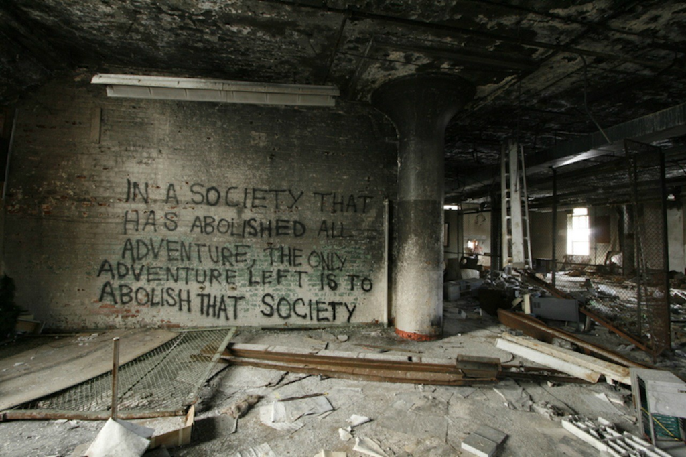

# Exercise 25

For this [challenge](https://gralhix.com/list-of-osint-exercises/osint-exercise-025/), we are required to locate the building with the art on the image and find another quote on the same building with a quote containing the word anarchy as indicated in the task briefing.

```jsx
The world is full of anonymous quotes. Several were written in the unidentified building seen below. 

Your task is to:

a) Locate the building.
b) Find the quote containing the word “anarchy”. 
```

Below is the image of the quote on the wall.



## Locate the building

For this area we shall start by performing a simple reverse image search to find some details about the art. From the reverse search we get a couple of results as shown below.


Looking at the [reddit](https://www.reddit.com/r/QuotesPorn/comments/zknat/in_a_society_graffiti_from_1968_protests_in/) source, it says it is in France, however, to verify if it is true, we shall now use the quote itself to search for the location as the quote seems to be behind a bigger mantra.

Using the quote itself I came across this [blog](https://www.colorblindedphoto.com/blog/tag/Abandoned) with an image that looks similar to the challenge photo as shown below.


Even though, the image on the blog is more older than the one on the challenge photo they look similar in many aspects. Moreover, from the blog we have been given a location `Sykes Datatronics Rochester, NY` we can search for this building and see if we can find more details about it and the art too.


As seen above, after searching for the building I visited the first link but got no results of our image but the [second](https://www.flickr.com/photos/axle81401/albums/72157621958651052/) one gave me more than I wanted, I also got a photo that was in the same building with the word anarchy hence solving our second question too.


When I zoom closer to the image with the quote is as seen below.


Now to find the location of the building, we shall go to google maps and search for the building.

When searching for the building on google maps, it redirects to abandoned subway rather than Sykes Datatronics as seen below.


Since from the blog we identified earlier says the building was unoccupied and was damaged with a number of fires over the year, we could search when it was abolished and use google earth pro to locate it.


From google AI, we now know it was demolished by 2014 furthermore, we have more details from this [link](https://www.rochestersubway.com/topics/2013/09/inside-the-abandoned-sykes-datatronics-building-rochester-ny/) where we are told, the building sits empty at `Orchard street` and we are provided with a link to google maps street view, here is the [link](https://www.google.com/maps/@43.1633824,-77.6345503,3a,75y,246.04h,117.8t/data=!3m7!1e1!3m5!1szBBNqfM7rOzQRa6e4FxnRg!2e0!6shttps:%2F%2Fstreetviewpixels-pa.googleapis.com%2Fv1%2Fthumbnail%3Fcb_client%3Dmaps_sv.tactile%26w%3D900%26h%3D600%26pitch%3D-27.799999999999997%26panoid%3DzBBNqfM7rOzQRa6e4FxnRg%26yaw%3D246.04!7i13312!8i6656?entry=ttu&g_ep=EgoyMDI1MDMxOS4yIKXMDSoASAFQAw%3D%3D).

`Answer: 384 Orchard Street`

## Find the quote containing the word “anarchy”

Scrolling through the [album](https://www.flickr.com/photos/axle81401/albums/72157621958651052/with/4881140524) we get our image with a quote that contains the word Anarchy as shown below.


`Answer: This office was a prison for our brothers and sisters in wage salvery. Let's make it a carnival for our brothers and sisters in anarchy`