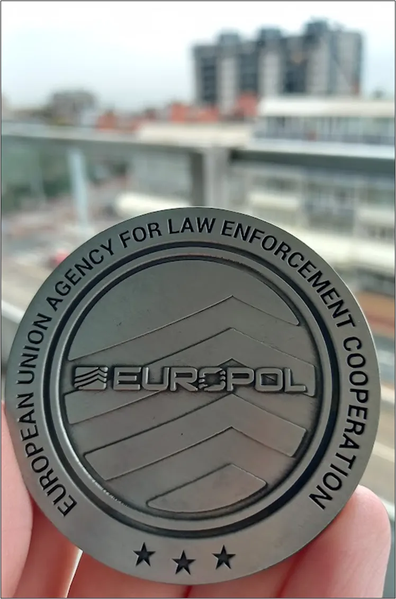

# Exercise 28

For this [challenge](https://gralhix.com/list-of-osint-exercises/osint-exercise-028/) we are provided with an image that we are required to find the details of the image as briefed below.

```jsx
Sometimes the fastest way to geolocate an image is to track down the 
movements of the person behind the lens. I took the photo below, on 20 
September 2023, at 08:11 local time.

Your task is to determine:

a) What device I used to take the photograph.
b) Where I was headed.
c) How far I was from the entrance of my destination.
```

there is also a bonus challenge `Bonus challenge: In which hotel did I stay?` 


Above is the full image from the challenge.

## What device I used to take the photograph

For this question we can check the image file metadata, metadata simply refers to a set of data that describes and gives information about other data.

We can use this [tool](https://www.metadata2go.com) to check the metadata of the image file or if you are using a UNIX based machine like kali linux, you can use a tool called `exiftool` the syntax to run the command is `exiftool <filename>` below is the details of the device used as seen in the metadata extractor.


searching the code of the machine online we get the following details


The code identifies the device as Samsung Galaxy A12

`Answer: Samsung SM-A125F camera model or Samsung Galaxy A12`

## Where I was headed

For this, we can start first by identifying where the person was on the time she was taking the photo. From the metadata, coordinates of the location of the image are usually embedded on the image, we can check if we have any longitude and latitude coordinates on the image metadata. There are no coordinates.

Wait from the task briefing, the image was taken on `20 September 2023,` we can filter for this date for any of her post on either of her social platforms to see where she was heading. We shall start with twitter by using some search dork queries for the specific date.


bingo we found a tweet that could be of interest, I played around with tweaking the dates form 20th to 3oth of September 2023 and came across this tweet, from the tweet, Sofia was part of the celebration of women in OSINT, going through the tweet pictures, I got this letter of appreciation dated `20th September 2023` on which Sofia was recognized for her contribution to the SIRUS CTF finale.


therefore Sofia was headed to the Europol’s event of women in OSINT. As seen from the post above, this is a good recognition to Sofia Santos, we could search this pot on her LinkedIn and see if we shall find more details of where she was headed for the event.


we have found the post, we can now go and check it out.


We have found more details, we can now search the Europol headquarters in Netherlands.


We have been able to find the headquarters’ location `Eisenhowerlaan 73, 2517 KK The Hague, Netherlands`

`Answer: Eisenhowerlaan 73, 2517 KK The Hague, Netherlands` 

## How far I was from the entrance of my destination

For this question lets first try and find the location on which the image was taken from as it could be near the venue but first I was able to identify some useful information on the image as seen below when zoomed closer.


The number `55.` We can try and search for something like `Eisenhowerlaan 55` on google maps and see if the place matches our image.


As seen above, we have been able to locate the building on `Eisenhowerlaan 55` we can now try and calculate the distance from this point to `Eisenhowerlaan 73` where the Europol headquarters is.


As seen above we have been able to locate the two places how far they were from each other  and got the distance as approximately `198 metres` 

`Answer: 198 metres` 

## Which hotel did I stay?

From the LinkedIn post, we can see an image of Sofia Santos holding a medal but the background is a bit blurred our, however, we can be able to see some features we can use to identify the hotel in which Sofia stayed.




As seen from the image above it is blurry but we are able to identify some features we can use to pinpoint the location on google earth pro.


I toured around Netherlands from the location of Europol headquarters and found a location with similar building structure which we highlighted with black as seen above.


Zooming in closer, we got the following houses from the image.


At this location, we can look around for hotels that have a similar balcony as that on the image.


After playing around with google street view, I was able to locate a hotel with similar balcony structure as that in the image and the hotel location is as shown below.


With that we have been able to find our hotel as shown below.


the name of the hotel is  `Ibis Styles Den Haag Scheveningen`  

`Answer:  Ibis Styles Den Haag Scheveningen `