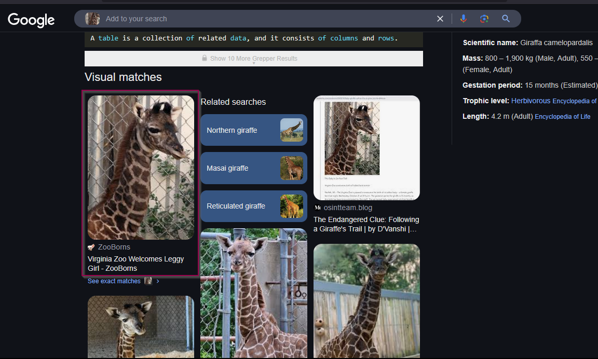

# Exercise 31

For this challenge we are required to find the giraffe and the status of the giraffe at the new location. Below is the task briefing

```idris
The newborn giraffe seen in the photo below belongs to an endangered 
species. Individuals such as this one, born in captivity, often 
participate in conservation programs. This may include transfers to 
accredited facilities for carefully planned breeding efforts aimed at 
ensuring the survival of their species.

Your task is to find the following information regarding the individual seen below:

a) Location and date of birth.
b) Current residence and date of arrival.
c) A photo in its current habitat.
```

Below is the image of the giraffe.


## Location and date of birth.

We shall start by first performing an image reverse search.



As seen above we have been able to find a source that contains an image that is a replica of our challenge image, we can click on the [link](https://www.zooborns.com/zooborns/2009/10/baby-giraffe-calf-at-the-virginia-zoo.html) of the image and find where the giraffe is located.

We have been able to identify more photos of the same baby giraffe as shown below.


and our challenge photo was from the blog itself as shown below.


From the blog, the baby giraffe is a girl, furthermore, from the blog we have two conflicting dates when the giraffe was born from the top the date is said to be `October 23rd` and as we go on to read more about the giraffe we find that the giraffe was again born on `October 21 at 9:15 p.m` so which date is true?

From the blog, the giraffe was born at Virginia zoo and we are provided with a link to the zoo’s website, we can try and search the website on web archive and see if we can fin a post about the giraffe’s birth as endangered species’ birth are usually a big deal and they require protection from poachers.


As seen above, going to the snapshot of `November 2 2009` we get the post of a masai giraffe that was born on `October 22, 2009`. Clicking on the [link](https://web.archive.org/web/20091031015448/http://www.virginiazoo.org/about-the-zoo/new-arrivals.asp), we find that the page was archived on `October 31` and below is the blog


We have a date that has two sources `October 21, 2009 at 9:15pm` on the archived post, the date was on a Wednesday and after clarifying the date it was truly on a Wednesday.


From the archived blog, we have a [link](https://web.archive.org/web/20100613025358/http://virginiazoo.org/about-the-zoo/giraffephotos.asp) that shows more images of the same baby giraffe.


and as seen above again, we have the same date again of `October 21 2009` therefore, with that information we can now say our baby Giraffe was born on October 21, 2009

`Answer:  Virginia Zoo date: October 21, 2009`

## Current residence and date of arrival

We now know the names of the parents to the baby Giraffe father `8-year-old male, Billy` and mother `7-year-old female, Imara` and it belong to the masai Species. We can now search for the parents on the website we initially found after doing reverse image search and see what details we shall find about the parents of the daughter.


From the new blog entry, we have some interesting information as shown below.


We have the name of our baby Giraffe birthed by Imara who is at `Disney's Animal Kingdom in Florida.` We shall search for this location and see if the giraffe is the same baby who was Virginia Zoo.


The source we found above, gave more information about the birthed Giraffe as shown below.


From the description on the blog above it matches our baby Giraffe, now we know our  Giraffe is called `Willow` and was moved to `Disney's Animal Kingdom in Florida` on `October 12` but we do not know which year the baby arrived at the Kingdom we shall search and find out on google.


From the source above, searching fro October 12, I got 2010 this is because from the post Wilow is 1-year-old and she was born on October 21 2009.


To verify I searched what day of the week it was on October 12, 2010 as seen below and it was truly a Tuesday.


`Answer: Disney's Animal Kingdom in Florida arrival date: October 12, 2010` 

## A photo in its current habitat

The search we did earlier of our baby Giraffe, we got many results and scrolling through the results I got a link claiming to be of our baby Giraffe as shown below.


This source was a false source as the image we have is not of a masai giraffe neither of a reticulated giraffe.


Below is the image from the found source.


As seen this giraffe is neither a reticulated nor a Masai Giraffe. We can redefine our search and try again as shown below.


From the [source](https://www.clickorlando.com/theme-parks/2020/12/04/disneys-animal-kingdom-welcomes-pair-of-masai-giraffe-calves-to-savanna/) identified we have found our girafffe but we shall verify if it is truly the one .


and we have clearly identified Willow as shown above below is the actual image.

