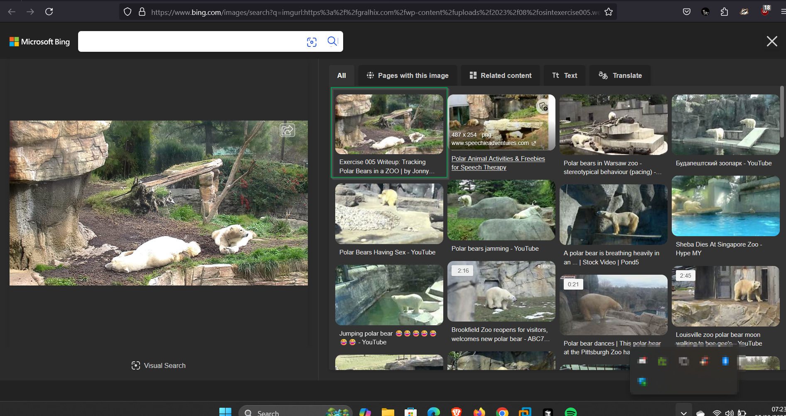

# Exercise 5

In this [challenge](https://gralhix.com/list-of-osint-exercises/osint-exercise-005/) we are required to find the location of the bears as stated in the task briefing below.

```bash
Task briefing: 
The image below is a screenshot from a zoo live cam. It was taken on January 15, 2023 at around 2pm local time. 
Please answer the questions below:

a) In which zoo are these polar bears located?
b) What was the temperature at the time of the screenshot?
c) What were the exact coordinates of where the bears were lying down?
```


To download the image, you can access it form this [link](https://gralhix.com/wp-content/uploads/2023/08/osintexercise005.webp).

## which zoo are these polar bears located

For this section we shall start by doing a reverse image search of the image and see if we can find a picture resembling the location shown on the image. After doing the reverse search, I got a writeup to this challenge but that is not what I was intending to get, therefore reverse image search did not serve my purpose.



From the task briefing we have some information we can use to get the location of the zoo,`screenshot from a zoo live cam` .This information will help find the zoo as it seems this zoo is unique as there are live cams that record the bears.


As seen above there are two zoos available, however, going through the Alaska zoo, I found nothing close to the photo that was taken but going through the san diego live cam feed on their [website](https://zoo.sandiegozoo.org/cams/polar-cam), I found the location of the photo with some identifying factors form the challenge photo as shown below.


Image captured from the San Diego zoo live feed camera.


Identifying factors from the challenge picture.

With that we have found the name of the zoo where the polar bears are located.

`Answer: San Diego zoo` 

## The temperature at the time of the screenshot

This one was interesting as I got to find out that America usually has historical data of temperature for different areas, this information I was able to get it after doing some searches online on how to get temperature data of pat days. The information for the temperature I was able to get it form this [site](https://www.wunderground.com/history).

Form the task briefing, the image was taken on `January 15, 2023 at around 2pm local time` with this, we can be able to get the approximate temperature.


The closest time range I could get close to 2pm was as shown below.


The temperature is in Fahrenheit, we can convert to degrees Celsius using this [tool](https://fc.kahi.cz/) as shown below.


The temperature is approximately 17 degrees Celsius.

`Answer: 62 fahrenheit or 16.67 degrees celsius` 

## The exact coordinates of where the bears were lying down

For this section we shall use google map to find the exact coordinates of where the bears were lying as shown below.

From the image in the challenge, we can see that there is an identifying factor that will aid us in getting the location of where the bears were lying.


Image analysis form the challenge photo.

As shown above the bears were lying close to the area with less grass on the edge(Less bushy edge) from the google maps, we can identify the area where this area is located as shown below.


From the image above we can now find the exact coordinates of where the bears were lying.

`Answer: 32°44'03.9"N 117°09'16.6"W`