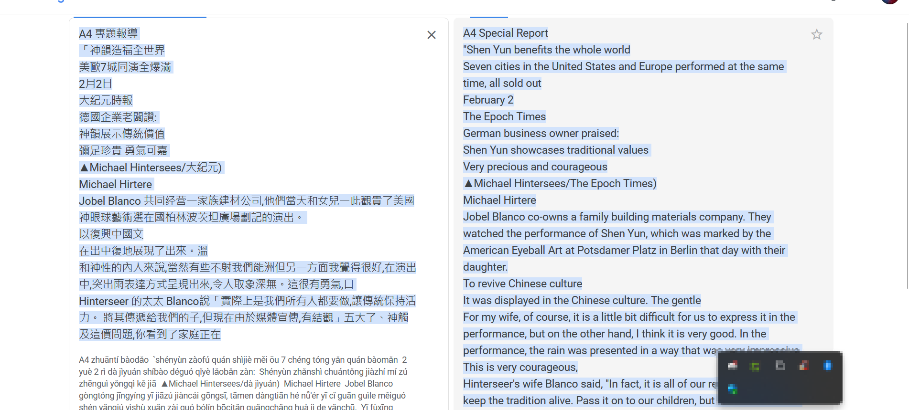

# Exercise 8

In this [challenge](https://gralhix.com/list-of-osint-exercises/osint-exercise-008/) we are provided with an image of a gazette where we are required to achive the following taks.

```bash
Please answer the following questions:
a) What was the audience applauding?
b) When was the photo taken?
c) What is the name of the venue?
```


## What was the audience applauding?

For this section, first we shall use google translate to change the words into  a language we can read easily as shown below.



With that we can search the news outlet which is epoch times and the performance was by shen yun.

`Answer: Shen Yun's performance of 2023 world tour`   

## When was the photo taken and the name of the venue?

For this section we shall perform some reverse image search to see if we can find anything of interest to us.


As shown above, we are able to find some details about the event. Interesting, we can now easily find more information about the event by accessing the two links I have identified in the image.

From this [link](https://en.minghui.org/html/articles/2023/1/13/206159.html) we got all the information about the image, the picture was taken on January 7,2023.


searching the name of the venue on google maps and having a street view of the same, we can easily verify the location of the venue.


`Answer: Date when photo was taken:Janary 7,2023 venue: Chrysler Hall in Norfolk, Virginia`