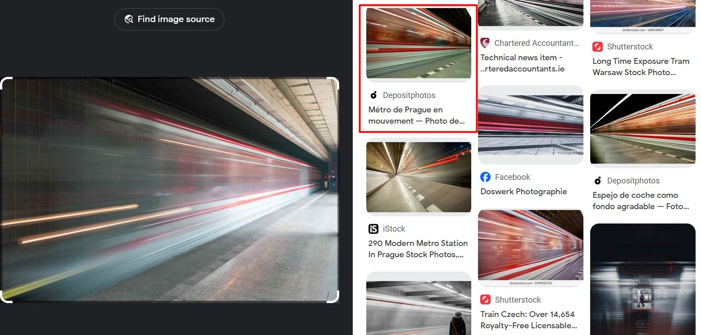

# On the Metro

Challenge description

```jsx
Watching the metro go past.Where is the photographer, 
what is the line, and where is the train heading?

What is the destination station for this train?
```

The image to the challenge can be accessed from this [link](https://challenge.bellingcat.com/assets/metro-BKEDT34w.jpg)

We can start by doing a reverse image search using google lens.



Let's focus on the natural light at the station, which indicates that the station is located on the surface. Looking at the list of metro stations in Prague, we find that **Hůrka** is one of the stations situated on the surface.


[https://en.wikipedia.org/wiki/List_of_Prague_Metro_stations](https://en.wikipedia.org/wiki/List_of_Prague_Metro_stations)

On Google Maps, a panorama view reveals the same warning stickers. The windows that emit the light are positioned on the wall opposite them.


On Street View and locate these windows; doing so reveals that the train is heading west.


An arrow indicates the direction in which the train is traveling.


The terminus of this line is Zličín

Answer: `Zličín`