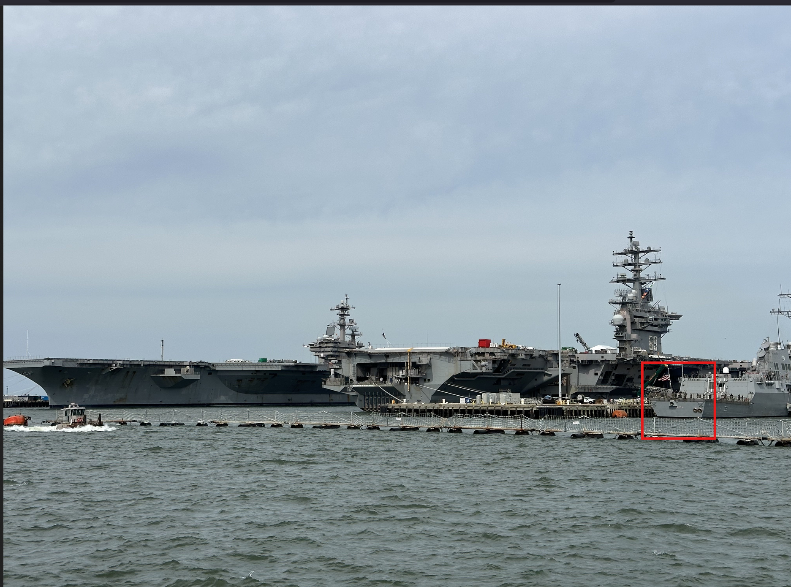

# Operation Fleet Finder

Challenge description

```jsx
Here are a handful of naval ships moored together, but grey is the only colour in sight. 

They all look the same! Can you help identify them?

What is the MMSI number for the left-most ship?
```

The image can be found in the [link](https://challenge.bellingcat.com/assets/military_shipyard-CEWyEkMk.jpg)

Being a huge fan of movies, from the look of the ship, it appears to be an US aircraft carrier.

Moreover, looking to the right of the image, there is an American flag as shown below.



We can now search for how many US aircraft carriers are there. I stumbled upon the following [Wikipedia link](https://en.wikipedia.org/wiki/List_of_aircraft_carriers_of_the_United_States_Navy) that gives details about the different air craft carriers in US. The George H W Bush aircraft had a lot of resemblance with the ship in the image as show below.


We can now check the MMSI number of the ship and submit it.

From this [link](https://en.wikipedia.org/wiki/USS_George_H._W._Bush), we get the MMSI number of the ship as below.


Answer: [`369970663`](https://www.marinetraffic.com/ais/details/ships/mmsi:369970663)