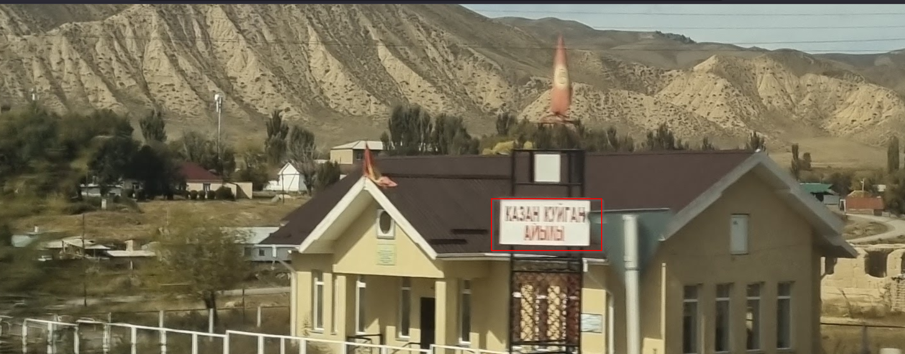
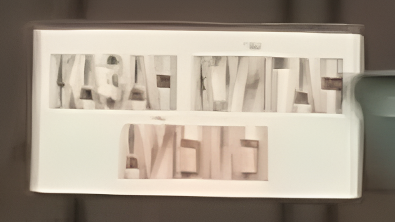

# Pulling Focus

Challenge description

```jsx
When
 Aiganysh was travelling by car, she took this photograph of a building.
 Despite her best efforts, the building came out a little blurry.
 
 Can you figure out what the building is used for?
 
 What is the function of this building?
```

The image can be found on this [link](https://challenge.bellingcat.com/assets/village_building-CyrovwPY.jpg)

This time we can start with image analysis, as from the board on the building we have some writings as shown below.



As seen above it is difficult to make the alphabets, we can try to zoom in further and see what we can see.


With this image we can then use this [tool](https://picsart.com/ai-image-enhancer/) to enhance the image. Below is the enhanced image.



From the above image, these letters look like they are Russian writings. Doing online research, we can use this [list](https://www.linguanaut.com/learn-russian/alphabet.php) of letters to see the alphabets that are similar.

From the list the first two words appear to be `КАЗАН КУЙГАН` we can start with this as the last word does not appear clearly. Let us go to google maps to search for the place to see if we can find it.


From the above image, it is a small village, we can try now to see the things that can help identify the location using the image provided to us.


We can look for a place that resembles this region from google maps.


We have found our location as shown above and below.


searching for the city in Wikipedia, I found a number of details as shown below.


I tried every thing on the article and library appeared to be the answer. Therefore, the structure is a library.

Answer: `library`