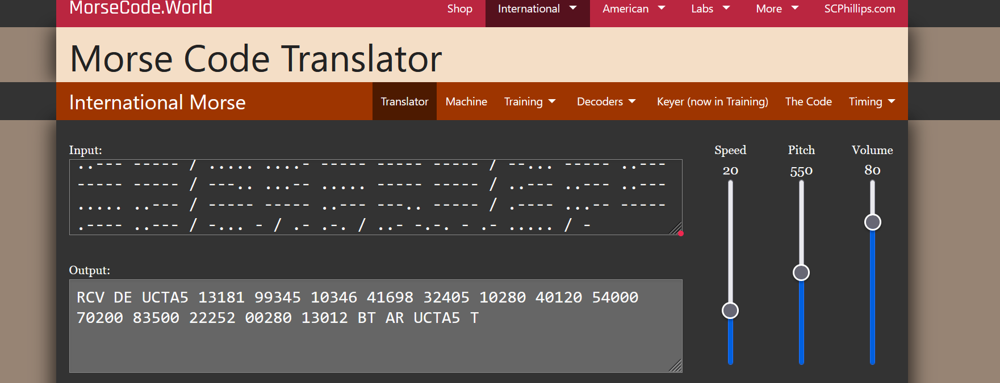

# Synoptic code

Challenge description

```jsx
This is a morse code transmission received on the 13th October 2024. The 
sender is thought to be the Yelnya, a Russian ship operating on the 
Black Sea..-.
 -.-. ...- / -.. . / ..- -.-. - .- ..... / .---- ...-- .---- ---.. .----
 / ----. ----. ...-- ....- ..... / .---- ----- ...-- ....- -.... / ....-
 .---- -.... ----. ---.. / ...-- ..--- ....- ----- ..... / .---- ----- 
..--- ---.. ----- / ....- ----- .---- ..--- ----- / ..... ....- ----- 
----- ----- / --... ----- ..--- ----- ----- / ---.. ...-- ..... ----- 
----- / ..--- ..--- ..--- ..... ..--- / ----- ----- ..--- ---.. ----- / 
.---- ...-- ----- .---- ..--- / -... - / .- .-. / ..- -.-. - .- ..... / 
-.Can you decode the message?

What was the reported air temperature in degrees Celsius? (give your answer to one decimal place i.e. "12.3")
```

The image for the challenge can be accessed form this [link](https://challenge.bellingcat.com/assets/morse-DseWZD6I.jpg).

We can use [morse code translator](https://morsecode.world/international/translator.html) tool to get the message first in order to get the reported air temperature in degrees.

Below is the translation of the message.



```jsx
RCV DE UCTA5 13181 99345 10346 41698 32405 10280 40120 54000 
70200 83500 22252 00280 13012 BT AR UCTA5 T
```

This message seems a bit weird, we can use chatgpt to get the temperature as shown below.


Answer: `28.0`