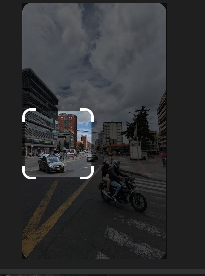

# The Rider’s view

Challenge description.

```jsx
This street scene was captured by Giancarlo, but perhaps he left out an historic detail.

What nearby monument can the rider see from their vantage point?

The monument is to a person, what is their name?
```

The image can be found from the [link](https://challenge.bellingcat.com/assets/crosswalk-DJ-1OZM6.jpg).

For this challenge we can do a reverse image search for some portions of the image to see what we shall find as shown below.



I picked this portion because of the pink structure that is outstanding and unique.

Below are the results but this [Instagram post](https://www.instagram.com/p/DNGV2HvuQ29/) gave us more details.


we can go to google  search for Bogota Movet with a pink dog(in spanish) structure following the details in the post as shown below.


searching online, we find the following place, Movet’s Chapinero office


we can then go to google maps and search for this particular place and see the monument we are suppose to find.


We have found the location where the bike was, viewing the street view, we are able to see where the monument is as shown below.


Getting closer to the monument, we get to see the following.


Answer: `Julio Flórez`