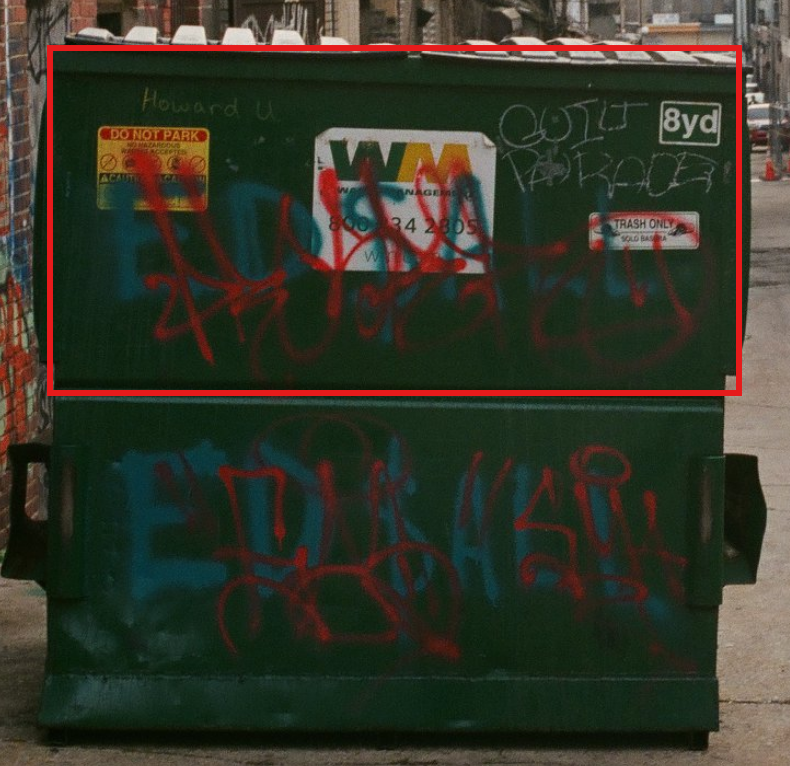

# What a Dump!

Challenge description

```jsx
Sometimes the most interesting things are found in the most unexpected places...
... but sometimes those places are full of trash.This dumpster is in an alley somewhere, but where?
Where was the photographer standing when they took this photo? 

Use latitude and longitude in decimal format with three decimals (12.345, -67.890).
```

The image to the challenge can be found [here](https://challenge.bellingcat.com/assets/dumpster-Dn3X1SEj.jpg).

We shall start by analyzing the image.



From the highlighted region, we have a number of information that gives us a lead.

1. Howard U
2. WASTE Management Inc.
3. Guild Parade

We can start to search what is Howard U, searching it online, we find the following details


It is a research University called Howard University and it is based in Washington DC. We can try play around with google lens to get to identify the roof of the buildings on the side to see where we will be taken to.


We have found this post that resembles a portion of the region


We can go to google maps and search for the region stated in the post `Minetta Tavern.` 

It is two miles from Howard University and near Brentwood. Looking at the streets nearby, we stumble upon a familiar picture of the street as shown below.


This is not sufficient enough since from the street view image, it appears to be have taken from the opposite side of the bridge as to the one of the challenge given. We need to find another angle view. A reverse image search again provided me with this [image](https://lmnophotos.com/).


Further analysis, helped me to find the co-ordiantes to where the image was taken.

Answer: `38.910,-76.998`

## Source

- [gudini1](https://teletype.in/@gudini1/bellingcat3)